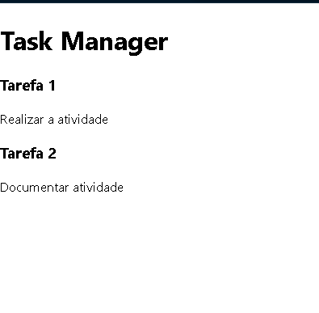

# Task Manager

 - Um gerenciador de tarefas simples criado em React para fins de aprendizado. Este projeto demonstra a criação de componentes React, uso de props e renderização dinâmica de elementos com base em listas.

## Funcionalidades

- Exibir um cabeçalho com o título do projeto.
- Renderizar dinamicamente uma lista de tarefas.
- Componentização com uso de **props** e **PropTypes** para validação.

## Tecnologias Utilizadas

- **React** - Biblioteca para criação de interfaces de usuário.
- **PropTypes** - Biblioteca para validação de propriedades nos componentes React.
- **CSS** - Para estilização simples (opcional).

## Estrutura do Projeto

```bash
task-manager/ ├── src/ │ ├── components/ │ │ ├── Header.js │ │ ├── TaskContainer.jsx │ │ └── Task.jsx │ ├── App.js │ └── index.js ├── public/ │ └── index.html ├── package.json └── README.md
```

## Como Usar

1. Clone o repositório:

```bash
git clone https://github.com/seu-usuario/task-manager.git
cd task-manager
```

## Validação com PropTypes

 - O componente Task valida as propriedades recebidas usando PropTypes:

```jsx
Task.propTypes = {
  title: PropTypes.string.isRequired,
  description: PropTypes.string.isRequired,
};
```

## Melhorias Futuras

 - Adicionar suporte para adicionar e remover tarefas.
 - Implementar estilos personalizados com CSS ou bibliotecas como Tailwind.
 - Gerenciamento de estado com useState ou Redux.

## Contribuição

 - Contribuições são bem-vindas! Sinta-se à vontade para abrir issues ou enviar pull requests.

```bash
│   │   ├── TaskContainer.jsx
│   │   └── Task.jsx
│   ├── App.js
│   └── index.js
├── public/
│   └── index.html
├── package.json
└── README.md
```

 - Como Usar
 
## Clone o repositório:

```git
git clone https://github.com/seu-usuario/task-manager.git
cd task-manager
```

## Instale as dependências:

```bash
npm install
```
## Inicie o servidor de desenvolvimento:

```bash
npm start
```

## Acesse o projeto no navegador:

```arduino
http://localhost:3000
```



## Como Criar um Botão Interativo em React

Este guia explica como adicionar um botão interativo ao seu aplicativo React.

---

## Passos

### 1. Criar o Componente do Botão
Adicione o seguinte código no arquivo `App.js` para criar o botão interativo:

```jsx
import React, { useState } from 'react';
import './App.css'; // Importa o CSS para estilos

function App() {
  const [buttonText, setButtonText] = useState('Clique aqui!');

  const handleClick = () => {
    alert('Botão clicado!');
    setButtonText('Clicado!');
  };

  return (
    <div className="App">
      <button onClick={handleClick} className="button">
        {buttonText}
      </button>
    </div>
  );
}

export default App;
```

## 2. Criar o Arquivo de Estilos
Crie um arquivo chamado App.css no mesmo diretório e adicione os estilos do botão:

```css
.button {
  padding: 10px 20px;
  font-size: 16px;
  background-color: #007BFF;
  color: #fff;
  border: none;
  border-radius: 5px;
  cursor: pointer;
  margin-top: 20px;
  transition: background-color 0.3s ease;
}

.button:hover {
  background-color: #0056b3;
}
´´´
